<h1 align="center">Hi 👋, I'm Khoa</h1>

<h3 align="center">
  Software Engineering Student | Web Systems & Applied AI Enthusiast
</h3>

<!-- SOCIAL & CONTACT ICONS -->
<p align="center">
  <a href="https://portfolio-lk-weld.vercel.app/" target="_blank" title="Personal Portfolio">
    
  </a>&nbsp;&nbsp;&nbsp;&nbsp;
  <a href="https://linkedin.com/in/nguyễn-võ-lê-khoa-7994823b5" target="_blank" title="LinkedIn">
    
  </a>&nbsp;&nbsp;&nbsp;&nbsp;
  <a href="mailto:khoanv249@gmail.com" title="Gmail">
    
  </a>&nbsp;&nbsp;&nbsp;&nbsp;
  <a href="https://github.com/KhoaSuyThan" target="_blank" title="GitHub">
    
  </a>
</p>

<p align="center">
  
</p>

<!-- ======================================================== -->
<!-- TERMINAL PROFILE SPECIFICATION                           -->
<!-- ======================================================== -->
## 💻 Terminal Console

```bash
khoa@workstation:~$ neofetch --profile
┌─────────────────────────── System Information ───────────────────────────┐
│ • Developer  : Nguyen Vo Le Khoa (Khoa)                                  │
│ • Academy    : Software Engineering @ HUTECH University, Vietnam         │
│ • Core Focus : Full-Stack Web Development                                │
│ • AI Passion : Applied AI, Computer Vision & Intelligent Web Integration │
│ • Portfolio  : https://portfolio-lk-weld.vercel.app/                     │
│ • Status     : Open for Software Engineering / Web & AI Internship roles │
│ • Philosophy : "Bridging resilient web architectures with AI solutions"  │
└──────────────────────────────────────────────────────────────────────────┘
```

<p align="center">
  
</p>

<!-- ======================================================== -->
<!-- LIVE AI PIPELINE SIMULATION (MLAI INSPIRATION)           -->
<!-- ======================================================== -->
## ⚡ Live AI Engine & Pipeline Simulation

<div align="center">
  
</div>

<p align="center">
  
</p>

<!-- ======================================================== -->
<!-- TECH ARSENAL & SKILLS (FOCUSED ON WEB & AI)              -->
<!-- ======================================================== -->
## 🛠️ Tech Arsenal & Stack

<div align="center">

### 🌐 Web Engineering & Full-Stack Development
<p>
  <a href="https://skillicons.dev">
    
  </a>
</p>

### 🤖 Applied AI, Databases & Cloud DevOps
<p>
  <a href="https://skillicons.dev">
    
  </a>
</p>

</div>

<p align="center">
  
</p>

<!-- ======================================================== -->
<!-- FEATURED PROJECTS SHOWCASE (WEB & AI FOCUSED)            -->
<!-- ======================================================== -->
## 🚀 Featured Projects

<table>
  <tr>
    <td width="50%" valign="top">
      <h3 align="center">🤖 SmartCV AI Builder</h3>
      <p align="center">
        
        
        
      </p>
      <p>Nền tảng ứng dụng web thông minh giúp người dùng kiến tạo, quản lý và tối ưu hóa hồ sơ năng lực (CV) chuyên nghiệp bằng AI.</p>
      <ul>
        <li>Kiến trúc Web MVC hiệu năng cao kết hợp Entity Framework & SQL Server.</li>
        <li>Tích hợp engine AI tự động phân tích và tối ưu hóa từ khóa chuẩn ATS theo ngành nghề.</li>
      </ul>
      <p align="center">
        <a href="https://smartcv-ai.io.vn/" target="_blank">
          
        </a>
      </p>
    </td>
    <td width="50%" valign="top">
      <h3 align="center">👁️ Olympic AI & Vision Intelligence</h3>
      <p align="center">
        
        
        
      </p>
      <p>Chuỗi thuật toán nghiên cứu Olympic AI và hệ thống thị giác máy tính thông minh ứng dụng trong phân tích hình ảnh và nhận diện mẫu.</p>
      <ul>
        <li>Nhận dạng và trích xuất đặc trưng thời gian thực bằng Principal Component Analysis (PCA).</li>
        <li>Tối ưu hóa pipeline xử lý ảnh độ trễ thấp phục vụ các tác vụ phân loại thông minh.</li>
      </ul>
      <p align="center">
        <a href="https://portfolio-lk-weld.vercel.app/" target="_blank">
          
        </a>
      </p>
    </td>
  </tr>
</table>

<p align="center">
  
</p>

<!-- ======================================================== -->
<!-- GITHUB CONTRIBUTION SNAKE ANIMATION                      -->
<!-- ======================================================== -->
## 🐍 Contribution Graph & Activity Stream

<div align="center">
  <picture>
    <source media="(prefers-color-scheme: dark)" srcset="https://raw.githubusercontent.com/KhoaSuyThan/KhoaSuyThan/output/github-contribution-grid-snake-dark.svg" />
    <source media="(prefers-color-scheme: light)" srcset="https://raw.githubusercontent.com/KhoaSuyThan/KhoaSuyThan/output/github-contribution-grid-snake.svg" />
    
  </picture>
</div>

<br />

<!-- ======================================================== -->
<!-- GITHUB METRICS & STREAK ANALYTICS                        -->
<!-- ======================================================== -->
<div align="center">
  
  
</div>

<p align="center">
  
</p>

<p align="center">
  
</p>

<!-- ======================================================== -->
<!-- FOOTER QUOTE                                             -->
<!-- ======================================================== -->
<div align="center">
  <p><i>"The best way to predict the future is to invent it through clean code and continuous learning."</i></p>
  <p>⭐ <b>KhoaSuyThan</b> • Web Systems & Applied AI</p>
</div>
